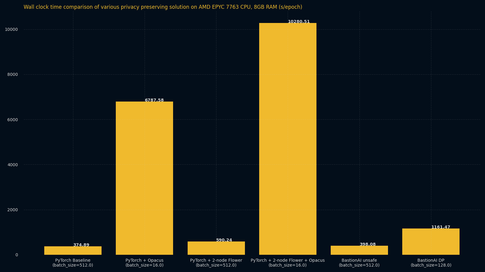

These benchmarks were done by finetuning the EfficientNet B0 model on CIFAR100 dataset. You can have a look to dataset used for it right [here](https://www.cs.toronto.edu/~kriz/cifar.html).

For these benchmarks we set the batch size to be the maximum possible, fitting in 8GB of RAM. 

Here you can have a look at the precise execution times.

|                                   |  Privacy   | SEV AMD EPYC 7763 Training Time (s/epoch) | AMD EPYC 7763 Training Time (s/epoch) | CPU Batch size |
| --------------------------------- | :--------: | :---------------------------------------: | :-----------------------------------: | :------------: |
| Pytorch (baseline)                |    None    |                                           |                374,89                 |      512       |
| PyTorch + Opacus                  | Incomplete |                                           |               6 787,58                |       16       |
| PyTorch + 2-party Flower          | Incomplete |                                           |                590,24                 |      512       |
| Pytorch + 2-party Flower + Opacus |     OK     |                                           |               10 280,51               |       16       |
| BastionAI (no DP, no TEE)         | Incomplete |                                           |                398,08                 |      512       |
| BastionAI (DP, no TEE)            | Incomplete |                                           |               1 161,47                |      128       |
| BastionAI (no DP, TEE)            | Incomplete |                  262,22                   |                  N/A                  |       F        |
| BastionAI (DP & TEE)              |     OK     |                                           |                  N/A                  |       F        |